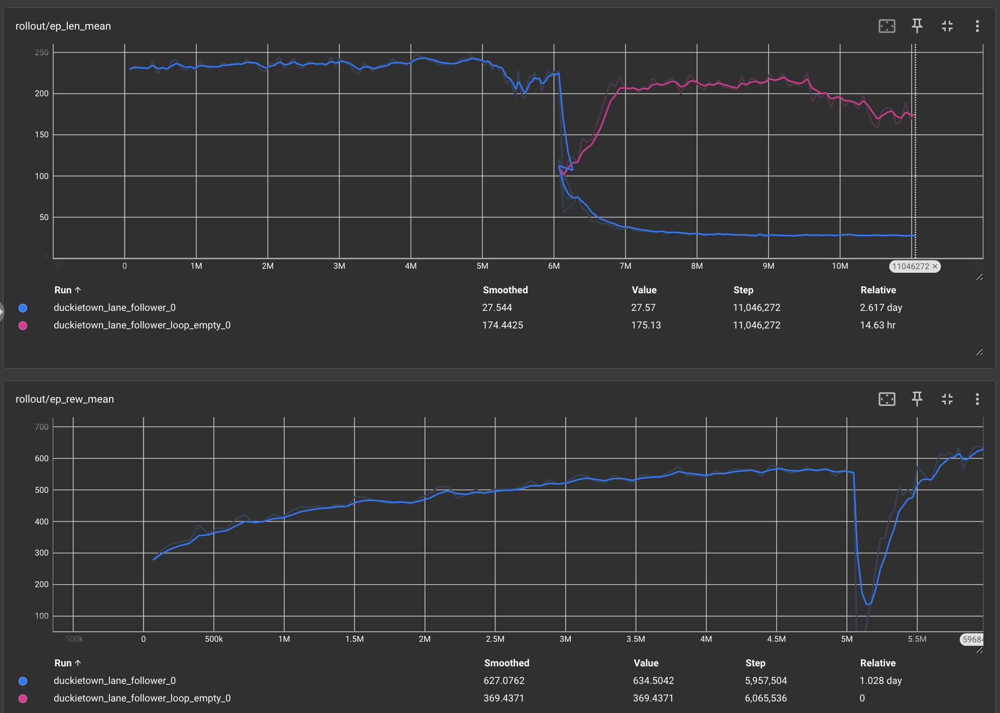
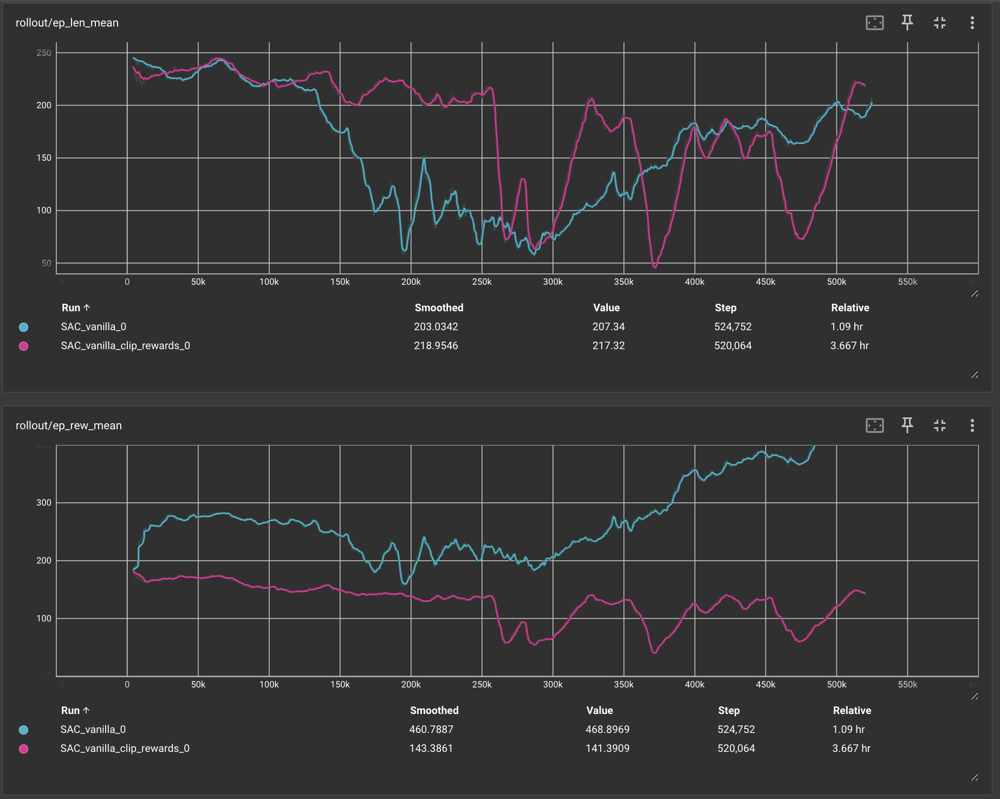

## Video

Embedded video of our project can be found below:

<iframe width="560" height="315" src="https://www.youtube.com/embed/YHD0_4aIGVs" frameborder="0" allowfullscreen></iframe>

The video includes a brief problem description using images, screenshots, or screen captures, along with examples of a simple policy (e.g., random) and our best-performing approach. The video is under three minutes, recorded in at least 720p resolution, and contains comprehensible speech where applicable.

## Project Summary

Our project focuses on developing an intelligent self-navigation system for DuckieBot within the DuckieTown simulation environment. The goal is to enable the DuckieBot to autonomously navigate through a miniature city-like environment using reinforcement learning (RL) techniques. This requires the robot to recognize lanes, follow them accurately, stop at traffic signals, and avoid obstacles such as walls, trees, and buses.

The primary challenge in this project stems from the complexity of autonomous driving, even in a constrained environment. Unlike traditional rule-based approaches, reinforcement learning offers a scalable solution but requires extensive training, fine-tuning, and robust environment modeling. In our case, the DuckieBot must learn to navigate dynamically without explicit programming for each scenario. To achieve this, we employ RL algorithms such as Soft Actor-Critic (SAC) and Proximal Policy Optimization (PPO), training the DuckieBot in a simulated environment before deploying it onto a real physical robot.

A major motivation for using AI/ML techniques is the inherent difficulty in defining precise rules for navigation in diverse and unpredictable conditions. The DuckieBot must recognize lane boundaries while adapting to different road layouts, varying obstacle placements, and dynamically changing environments. It needs to anticipate and react to traffic signals, avoid collisions with moving and stationary objects, and navigate turns effectively. Hand-coding these behaviors for every possible scenario is impractical, making RL a natural choice for training an adaptable and generalizable navigation policy.

### Key Objectives:
- Train a DuckieBot using reinforcement learning algorithms to navigate the town autonomously.
- Compare **Soft Actor-Critic (SAC)** and **Proximal Policy Optimization (PPO)** for performance evaluation.
- Deploy the trained model onto an actual DuckieBot for real-world testing.

With recent progress, we successfully ran the DuckieBot in an empty loop environment, demonstrating basic movement capabilities. The next steps involve refining policies for better performance in complex environments.

## Approaches  

### SAC Approach  
Our initial exploration included implementing a **Soft Actor-Critic (SAC)** model to train the DuckieBot. SAC is an off-policy reinforcement learning algorithm that optimizes for stability and exploration efficiency.  

- **State Representation:**  
  - `(x, z)`: The 2D position of the DuckieBot.  
  - `sin(θ), cos(θ)`: Encodes the orientation of the DuckieBot.  
  - `velocity`: Measures the DuckieBot’s speed.  

- **Action Space:**  
  - **Velocity control:** Continuous values in `[-1, 1]` (reverse to forward motion).  
  - **Steering control:** Continuous values in `[-1, 1]` (right to left turns).  

- **Reward System:**  
  - Small positive rewards for forward movement.  
  - Penalties for deviations from the center of the lane.  
  - Large penalties for collisions with obstacles or moving outside lane boundaries.  

Despite our efforts in fine-tuning SAC, we observed **unstable training and poor lane adherence**, leading us to explore alternative approaches.  

### PPO Approach  
Through extensive experimentation, we determined that **Proximal Policy Optimization (PPO)** was a better fit for our project. PPO’s **on-policy learning** and sample efficiency made it a more stable choice for lane-following and collision avoidance.  

- **Observation and Policy:**  
  - Uses a **CNN-based policy** to process image-based inputs.  
  - Modified input to **84×84 resolution with a 3-frame stack** for improved temporal awareness.  

- **Model Parameters**
  - **Learning Rate:** `3e-4`
  - **Steps per Rollout (N Steps):** `1024`
  - **Batch Size:** `256`
  - **N Epochs:** `10`
  - **Gamma (Discount Factor):** `0.99`
  - **GAE Lambda:** `0.95`
  - **Clip Range:** `0.3`
  - **Entropy Coefficient (ent_coef):** `0.01`
  - **Value Function Coefficient (vf_coef):** `0.5`
  - **Max Gradient Norm:** `0.5`

- **Simulator Parameters**
  - **Domain Randomization:** `False`
  - **Max Steps per Episode:** `250`
  - **Draw Curve:** `False`
  - **Draw Bounding Box:** `False`
  - **Camera Width:** `84`
  - **Camera Height:** `84`

- **Training Configuration**
  - **Seed:** `47`
  - **Number of Environments:** `8`
  - **Reinforcement Learning Algorithm:**  
    - `Stable Baseline 3 PPO`
  - **Total Timesteps:** `5,000,000`

- **Training Details:**  
  - **Basic PPO Training:** Initial experiments using a baseline PPO model.  
  - **Framestacked PPO Training:** Trained in **3M and 5M timesteps** in `loop_empty` after fixing the camera resolution and adding frame stacking.  
  - **PPO with DDPG Reward:** Trained in **3M and 5M timesteps** in `small_loop` after integrating the DDPG reward function.  
  - **PPO with DtReward:** Further training in **3M and 5M timesteps** using the DtReward function for better lane-following stability.  
  - **Latest Update:** Applied a **basic obstacle avoidance reward** to improve real-world applicability.  

## Custom Reward Function
- **Encouraging Forward Motion:**  
  - The agent is rewarded for moving forward in a stable manner.  
  - Prevents the vehicle from spinning in place or getting stuck.  

- **Penalizing Lane Deviations:**  
  - Negative rewards are applied when the vehicle moves out of its lane.  
  - Encourages alignment with the center of the lane to improve navigation.  

- **Minimizing Collisions:**  
  - A heavy penalty is assigned when the vehicle collides with obstacles.  
  - Ensures the model learns to avoid objects and drive cautiously.  

- **Discouraging Reverse Driving:**  
  - A slight penalty is given when the agent moves in reverse unnecessarily.  
  - Reinforces forward driving as the optimal strategy.  

- **Lane-Centric Corrections:**  
  - The agent receives feedback based on lane-center distance and angle.  
  - Helps refine turning and smooth lane-following behavior.
  
### Process and Iterative Improvements  

Initially, we worked individually to set up simulations and train models using both SAC and PPO. However, as our experiments progressed, we observed **better results with PPO**, leading us to focus on refining that approach.  

#### Key Iterations and Learnings  

- **Initial Training Challenges:**  
  - Despite extensive training, **performance remained suboptimal** with standard PPO settings.  
  - Increasing timesteps and modifying hyperparameters led to **only marginal improvements**.  

- **Breakthrough with Camera Input Fix:**  
  - A **meeting with JB** led to a key adjustment—**fixing the resolution to 84×84** and implementing a **3-frame stack** for the camera input.  
  - This **significantly improved the smoothness** of lane-following behavior.  

- **Stability Issues & Reward Modifications:**  
  - Even with improved visual input, the model still struggled with **consistent lane adherence**.  
  - Exploring **DDPG-based rewards** led to higher driving speeds but also **instability when obstacles were introduced**.  
  - The vehicle frequently **switched lanes** or **lost control** due to unintended penalty structures.  

- **Map Simplification & Reward Tuning:**  
  - To gain better control over training conditions, we **transitioned from the "loop_empty" map to the simpler "small_loop" map**.  
  - We replaced the **DDPG reward system** with the **DtReward function** from an existing reinforcement learning repo ([GitHub Link](https://github.com/marton12050/T.T-duckietown)).  
  - With these refinements, the DuckieBot demonstrated **smoother navigation and better lane centering**.  

### Next Steps  
While our model now successfully follows lanes, **obstacle avoidance remains a major challenge**. Our focus moving forward includes:  
- Further optimizing PPO’s **reward structure** to improve generalization.  
- Expanding training to more **complex environments** beyond "small_loop."  
- Exploring **additional model architectures** or hybrid approaches for improved robustness.  

## Evaluation

### Quantitative Evaluation
Metrics used for evaluation:
- **Mean Episode Reward (`ep_rew_mean`)**: Measures policy effectiveness. Currently, SAC struggles with lane adherence, leading to lower rewards.
- **Mean Episode Length (`ep_len_mean`)**: Shorter episodes indicate frequent collisions.

**Performance Charts:**
### PPO Lane Following Model
   

   
This model is frame-stacked, uses the specified hyperparameters, and is trained for 6 million timesteps on the small loop map in Duckietown before transitioning to the more sophisticated loop_empty map. The results show a sudden drop in rewards around 6 million timesteps, which occurs because the model's reward dynamics change when it is trained on the new map. After this drop, the model recovers and achieves higher rewards, successfully adapting to the new environment. This figure demonstrates how we took a model trained on a small loop map, transferred it to the larger, more complex loop_empty map, and the model successfully adapted and transferred its learning.

### SAC Unsuccessfull Attempt
   

   
This new TensorBoard plot shows two graphs: one for the mean episode length (ep len mean) and one for the mean episode reward (ep rew mean). It compares two implementations of the SAC model: 1) Vanilla SAC and 2) Vanilla SAC with rewards clipped to the range (-1, 1). Both models are frame-stacked with a history of 3 frames and use an updated reward function (penalizing reversing and lane centering). The plots reveal that SAC performed poorly on Duckietown, showing instability and failing to accumulate enough rewards. Clipping the rewards diminished their effectiveness, as it truncated valuable information, while the unclipped SAC showed slow learning. Ultimately, due to these issues, we decided to focus on PPO instead.

### Qualitative Evaluation
- **Visual Inspection**: Reviewing recorded runs to assess lane-following behavior.
- **TensorBoard Logs**: Used for tracking policy learning progress.
- **Challenges Identified**:
  - Frame rate issues in high-performance computing (HPC) environments.

## Training Progress and GIFs  

### **Basic PPO Training**  
Initial experiments using a baseline PPO model.  
  
  

### **Framestacked PPO Training**  
Trained in **3M and 5M timesteps** in `loop_empty` after fixing the camera resolution and adding frame stacking.  
**3M Training:**  
  

**5M Training:**  
  

### **PPO with DDPG Reward**  
Trained in **3M and 5M timesteps** in `small_loop` after integrating the DDPG reward function.  
**3M Training with DDPG Reward:**  
  

**5M Training with DDPG Reward:**  
  

### **PPO with DtReward**  
Further training in **3M and 5M timesteps** using the DtReward function for better lane-following stability.  
**3M Training with DtReward:**  
  

**5M Training with DtReward:**  
  

### **Latest Update: Obstacle Avoidance**  
Applied a **basic obstacle avoidance reward** to improve real-world applicability.  

## References

### Libraries Used
- PyTorch
- OpenAI Gym
- Duckietown Gym
- NumPy
- Matplotlib

### GitHub Repositories
- [Pytorch SAC Implementation](https://github.com/pranz24/pytorch-soft-actor-critic/blob/master/sac.py)
- [Duckietown Gym](https://github.com/duckietown/gym-duckietown)

### Papers and Documentation
- [Duckietown MBRL Documentation](https://www.alihkw.com/duckietown-mbrl-lib/)
- [Duckietown Simulation Guide](https://docs.duckietown.com/ente/devmanual-software/intermediate/simulation/index.html#simulator-running-headless)
- [Reward System](https://github.com/marton12050/T.T-duckietown)

## AI Tool Usage
We used AI tools in the following ways:
- **Reinforcement Learning Algorithms**: PPO and SAC were implemented using AI/ML frameworks such as PyTorch and Stable-Baselines3.
- **Visualization & Debugging**: TensorBoard and Matplotlib for logging and model performance evaluation.
- **Code Assistance**: Used GPT-based tools for debugging and optimizing hyperparameters.

Further refinements will involve tuning hyperparameters and deploying the final trained model onto the DuckieBot for real-world testing.

