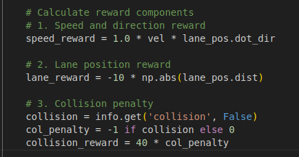
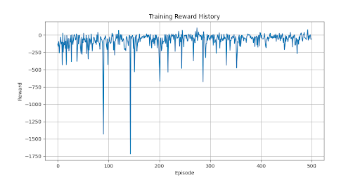
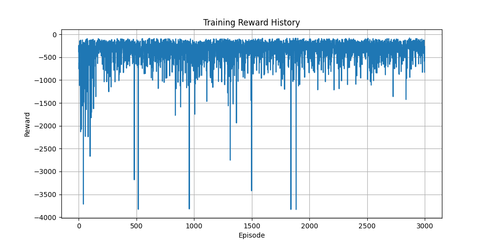
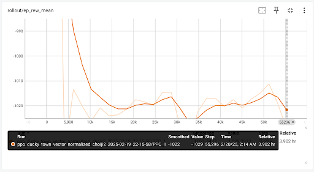
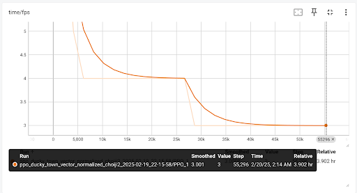
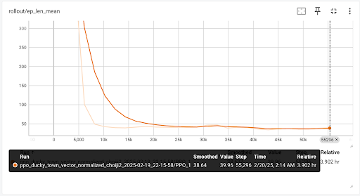

# DuckieTown Project Status 

## Project Summary
We decided to work on the Duckietown project. The goal of our project is to develop an intelligent system for DuckieBot that enables self-navigation within the "Town" using reinforcement learning and machine learning. Our focus is on developing a simulation-based Duckietown environment and deploying a machine-learning-based solution to train the DuckieBot to detect lanes, follow them, recognize signals, stop when necessary, and avoid collisions with other objects such as walls, trees, and buses. Additionally, the system should respond effectively to environmental factors.

To achieve this, we will either purchase or create a DuckieBot equipped with a camera for sensor data collection. The DuckieBot should be capable of driving (accelerating), stopping, and turning. This is an exciting and novel project for us, and we believe it will significantly enhance our technical knowledge and teamwork skills. We are committed to collaborating effectively to ensure the successful completion of this project.

## Approach
Since we aim to compare the performance of **Soft Actor-Critic (SAC)** and **Proximal Policy Optimization (PPO)**, our team is split into two groups: one focusing on PPO and the other on SAC training.

### **SAC Approach**
For SAC (not using Stable-Baselines3's SAC implementation), we use a **5-dimensional state space**:
- `(x, z)`: 2D position of the DuckieBot.
- `sin(θ), cos(θ)`: Direction of the DuckieBot.
- `velocity`: Speed of the DuckieBot.

The **2-dimensional action space** consists of:
- **Velocity**: (-1 for reverse, 0 for stop, 1 for forward).
- **Steering**: (-1 for right turn, 0 for straight, 1 for left turn).

The reward structure is designed as follows:
- Small rewards for forward progress.
- Small penalties for being off-center.
- Large penalties for collisions.

### **PPO Approach**
For PPO, we follow a CNN-based policy to process image-based observations. The key hyperparameters include:
- Learning rate: `3e-4`
- Steps per rollout: `1024`
- Discount factor (γ): `0.99`
- GAE Lambda: `0.95`
- Entropy coefficient: `0.01`

Training is conducted for **100,000 timesteps**, utilizing a **vectorized environment setup** with `make_vec_env` and `VecTransposeImage` to ensure proper input shape.

## Evaluation
### **Quantitative Evaluation**
We assess performance using key metrics:
- **Mean Episode Reward (`ep_rew_mean`)**: The average cumulative reward per episode. Currently, SAC's training results show poor performance, as the DuckieBot frequently veers off-lane and incurs penalties.
- **Mean Episode Length (`ep_len_mean`)**: The average number of timesteps per episode. A decreasing trend suggests increased collisions, which shorten episode duration.
- **Frames per Second (`fps`)**: The FPS rate is **<10**, which may hinder performance, particularly for CNN-based policies that rely on visual input.

Due to these challenges, we plan to:
- Train for **5000 to 1M episodes**.
- Experiment with **different hyperparameters**.
- Test **Stable-Baselines3's SAC implementation** instead of our current approach.

### **Qualitative Evaluation**
- We visually inspect the agent’s trajectory to assess lane adherence.
- TensorBoard is used for logging and video recording.
- A key challenge observed is **slow frame rates in HPC environments**, which impact training and evaluation speed.

## Remaining Goals and Challenges
### **Challenges**
- **First-time experience with RL**: Each team member faced different challenges, mostly related to environment setup.
- **Cross-platform issues**: Our team uses different operating systems (MacOS, Windows, and Linux), causing difficulties in setting up a unified environment.
- **Setup difficulties**: We've had four TA meetings for assistance and hope to resolve these issues soon.
- **Poor training results**: Both SAC and PPO are currently underperforming, necessitating further refinement.

### **Goals**
- Select **one** model (SAC or PPO) to focus on for the rest of the quarter.
- Continue training with **more steps, more episodes, and different hyperparameters** until satisfactory results are achieved.
- Deploy the trained model onto a **physical DuckieBot**.

## Resources Used
### **Libraries**
- PyTorch
- OpenAI Gym
- Duckietown Gym
- NumPy
- Matplotlib

### **GitHub Repositories**
- [Pytorch SAC Implementation](https://github.com/pranz24/pytorch-soft-actor-critic/blob/master/sac.py)
- [Duckietown Gym](https://github.com/duckietown/gym-duckietown)

### **Papers and Websites**
- [Duckietown MBRL Documentation](https://www.alihkw.com/duckietown-mbrl-lib/)
- [Duckietown Simulation Guide](https://docs.duckietown.com/ente/devmanual-software/intermediate/simulation/index.html#simulator-running-headless)

